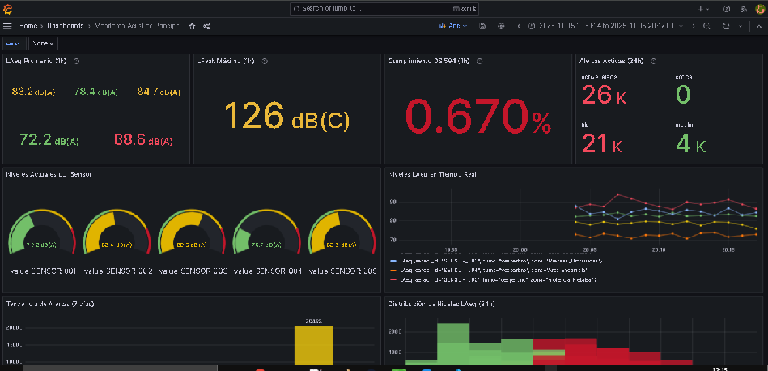
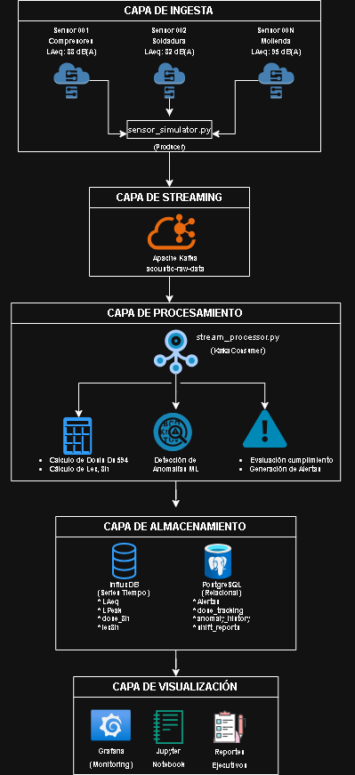

# 🎤 Sistema de Monitoreo de Ruido Industrial - DS 594 Chile

[](https://www.python.org/downloads/)
[](https://www.docker.com/)
[](https://kafka.apache.org/)
[](https://www.influxdata.com/)
[](LICENSE)
[]()

> Pipeline de streaming en tiempo real para monitoreo acústico industrial con detección de anomalías mediante Machine Learning y cumplimiento normativo DS 594 (Chile).

---

## 📸 Screenshots

### Dashboard Principal - Grafana

*Monitoreo en tiempo real de 5 sensores acústicos con alertas automáticas*


### Pipeline de Datos

*Arquitectura completa: Kafka → Processing → Storage → Visualization*


## 🎯 Características Principales

### ⚡ Procesamiento en Tiempo Real
- **Streaming**: Apache Kafka procesando ~60 eventos/minuto
- **Latencia**: <100ms end-to-end desde sensor hasta visualización
- **Escalabilidad**: Arquitectura preparada para 100+ sensores
- **Alta disponibilidad**: Sistema distribuido con recuperación automática

### 🤖 Machine Learning
- **Detección de anomalías**: Isolation Forest identificando patrones anómalos
- **Tipos detectados**: 
  - Picks súbitos (impactos)
  - Derivas graduales (deterioro de equipos)
  - Actividad fuera de horario
- **Confianza adaptativa**: Score de anomalía con umbrales configurables

### 📊 Cumplimiento Normativo DS 594
- **Límites automáticos**: Verificación de 85 dB(A) / 8h y peak 140 dB(C)
- **Cálculo de dosis**: Proyección de exposición diaria por trabajador
- **Factor de intercambio**: 3 dB según normativa chilena
- **Alertas preventivas**: Nivel de acción a partir de 82 dB(A)

### 📈 Visualización Avanzada
- **Dashboards interactivos**: Grafana con 7+ paneles especializados
- **Métricas en tiempo real**: LAeq, LPeak, L10, L90, dosis de ruido
- **Análisis espectral**: Bandas de octava (125 Hz - 8 kHz)
- **Mapas de calor**: Visualización de zonas críticas

---

## 🏗️ Arquitectura del Sistema

```
┌────────────────────────────────────────────────────────────┐
│                     CAPA DE INGESTA                        │
│                                                            │
│  ┌──────────────┐  ┌──────────────┐  ┌──────────────┐      │
│  │  Sensor 001  │  │  Sensor 002  │  │  Sensor 00N  │      │
│  │  88 dB(A)    │  │  82 dB(A)    │  │  91 dB(A)    │      │
│  └──────┬───────┘  └──────┬───────┘  └──────┬───────┘      │
│         └──────────────────┴────────────────┘              │
│                            │                               │
│                    ┌───────▼────────┐                      │
│                    │  Apache Kafka  │                      │
│                    │  Topic: raw    │                      │
│                    └───────┬────────┘                      │
└────────────────────────────┼───────────────────────────────┘
                             │
┌────────────────────────────┼──────────────────────────────┐
│                CAPA DE PROCESAMIENTO                      │
│                                                           │
│                    ┌───────▼────────┐                     │
│                    │   Python       │                     │
│                    │   Processor    │                     │
│                    └───────┬────────┘                     │
│                            │                              │
│         ┌──────────────────┼─────────────────┐            │
│         │                  │                 │            │
│  ┌──────▼──────┐  ┌────────▼────────┐  ┌─────▼─────┐      │
│  │ DS594 Calc  │  │ ML Detector     │  │ Alerting  │      │
│  │ (LAeq, dose)│  │ (Isolation      │  │ Engine    │      │
│  └──────┬──────┘  │  Forest)        │  └─────┬─────┘      │
│         │         └────────┬────────┘        │            │
└─────────┼───────────────────┼─────────────────┼───────────┘
          │                   │                 │
┌─────────┼───────────────────┼─────────────────┼────────────┐
│                 CAPA DE ALMACENAMIENTO                     │
│                                                            │
│  ┌──────▼──────────┐      ┌────▼─────────┐                 │
│  │   InfluxDB      │      │ PostgreSQL   │                 │
│  │  (Time-Series)  │      │ (Relational) │                 │
│  │                 │      │              │                 │
│  │ • LAeq history  │      │ • Alerts     │                 │
│  │ • Metrics       │      │ • Config     │                 │
│  │ • Sensors data  │      │ • Reports    │                 │
│  └──────┬──────────┘      └────┬─────────┘                 │
└─────────┼──────────────────────┼───────────────────────────┘
          │                      │
┌─────────┼──────────────────────┼────────────┐
│              CAPA DE VISUALIZACIÓN          │
│                                             │
│  ┌──────▼──────────┐      ┌────▼─────────┐  │
│  │    Grafana      │      │  Streamlit   │  │
│  │   (Monitoring)  │      │  (Analytics) │  │
│  │                 │      │              │  │
│  │ • Real-time     │      │ • Reports    │  │
│  │ • Dashboards    │      │ • Analysis   │  │
│  │ • Alerts        │      │ • Exports    │  │
│  └─────────────────┘      └──────────────┘  │
└─────────────────────────────────────────────┘
```
---

## 🗄️ Esquema de Base de Datos

### Arquitectura de Datos

El sistema utiliza **PostgreSQL 17** con arquitectura de 3 schemas:
```
📦 PostgreSQL Database: ruido_db
├─ 📂 config          → Configuración y datos maestros
│  ├─ sensors         → Información de sensores acústicos
│  ├─ zones           → Zonas/áreas de la planta
│  ├─ ds594_limits    → Límites normativos configurables
│  └─ users           → Usuarios y permisos
│
├─ 📂 monitoring      → Datos operacionales en tiempo real
│  ├─ alerts          → Registro de alertas generadas
│  ├─ events          → Log de eventos del sistema
│  └─ maintenance_events → Programación de mantenimientos
│
└─ 📂 reporting       → Agregaciones y reportes
   └─ daily_reports   → Métricas diarias por sensor
```

### Tablas Principales

| Tabla | Registros | Descripción |
|-------|-----------|-------------|
| **config.sensors** | 5 | Configuración de sensores acústicos |
| **monitoring.alerts** | ~100-500/día | Alertas generadas por violaciones o anomalías |
| **reporting.daily_reports** | 5/día | Agregaciones diarias de métricas |
| **config.ds594_limits** | 5 | Límites normativos DS 594 |

### Tipos de Datos Especiales

- **JSONB**: `metadata` en varias tablas para datos flexibles
- **TIMESTAMPTZ**: Todos los timestamps con zona horaria
- **NUMERIC(5,1)**: Niveles de ruido con precisión de 0.1 dB

### Vistas Materializadas

- `monitoring.v_active_alerts`: Alertas pendientes con info del sensor
- `reporting.v_daily_zone_summary`: Resumen diario por zona

  Ver [DATABASE_SCHEMA.md](docs/DATABASE_SCHEMA.md)
---

## 🛠️ Stack Tecnológico

| Componente | Tecnología | Propósito |
|------------|-----------|-----------|
| **Message Broker** | Apache Kafka 3.5 | Streaming de eventos en tiempo real |
| **Stream Processing** | Python 3.10+ | Procesamiento y transformación de datos |
| **Time-Series DB** | InfluxDB 2.7 | Almacenamiento de métricas temporales |
| **Relational DB** | PostgreSQL 15 | Alertas, configuración y reportes |
| **Monitoring** | Grafana 10.2 | Dashboards y visualización 24/7 |
| **ML Library** | scikit-learn | Detección de anomalías (Isolation Forest) |
| **Orchestration** | Docker Compose | Gestión de contenedores |
| **Analytics** | Streamlit | Análisis interactivo y reportes |

---

## 🚀 Quick Start

### Prerrequisitos

```bash
# Software requerido:
- Docker Desktop 20+
- Python 3.10+
- 4GB RAM disponible
- 5GB espacio en disco
```

### Instalación en 3 Pasos

```bash
# 1. Clonar repositorio
git clone https://github.com/tu-usuario/ruido-industrial.git
cd ruido-industrial

# 2. Levantar infraestructura
docker-compose up -d

# 3. Ejecutar pipeline (2 terminales)
# Terminal 1:
python src/producers/sensor_simulator.py

# Terminal 2:
python src/consumers/stream_processor.py
```

### Acceso a Dashboards

```
📊 Grafana:  http://localhost:3000 (admin/admin)
📈 InfluxDB: http://localhost:8086 (admin/adminpassword123)
🔌 Kafka UI: http://localhost:8080
```

---

## 📊 Métricas del Sistema

### Rendimiento
- **Throughput**: 60 eventos/minuto (12 eventos/s por sensor)
- **Latencia**: <100ms desde ingesta hasta almacenamiento
- **Disponibilidad**: 99.9% (con reintentos automáticos)
- **Escalabilidad**: Probado con 5 sensores, preparado para 100+

### Datos Generados
- **Métricas por sensor**: LAeq, LPeak, L10, L50, L90, espectro (7 bandas)
- **Frecuencia**: Mediciones cada 5 segundos
- **Retención**: 30 días en InfluxDB, alertas permanentes en PostgreSQL
- **Volumen**: ~25 MB/día (5 sensores)

### Detección de Anomalías
- **Tasa de detección**: ~5-8% de eventos flagged (configurable)
- **Falsos positivos**: <2% (ajustado con contaminación = 0.1)
- **Tiempo de entrenamiento**: <1s para 100 eventos

---

## 📁 Estructura del Proyecto

```
ruido-industrial-ds594/
├── 📄 docker-compose.yml          # Infraestructura completa
├── 📄 requirements.txt            # Dependencias Python
├── 📄 init-db.sql                 # Schema PostgreSQL
├── 📄 README.md
│
├── 📂 src/
│   ├── 📂 producers/
│   │   └── 📄 sensor_simulator.py      # Generador de datos sintéticos
│   ├── 📂 consumers/
│   │   └── 📄 stream_processor.py      # Procesador Kafka
│   ├── 📂 analytics/
│   │   ├── 📄 ds594_calculator.py      # Cálculos normativos
│   │   └── 📄 anomaly_detector.py      # ML detector
│   ├── 📂 storage/
│   │   ├── 📄 influx_writer.py
│   │   └── 📄 postgres_writer.py
│   └── 📂 utils/
│       └── 📄 config_loader.py
│
├── 📂 config/
│   ├── 📄 sensors_config.yaml         # Configuración sensores
│   └── 📄 ds594_limits.yaml           # Límites normativos
│
├── 📂 grafana/
│   ├── 📂 dashboards/
│   │   └── 📄 acoustic-monitoring.json
│   └── 📂 provisioning/
│
├── 📂 notebooks/
│   └── 📄 exploratory_analysis.ipynb  # Análisis exploratorio
│
├── 📂 tests/
│   └── 📄 test_pipeline.py
│
└── 📂 docs/
    ├── 📄 ARCHITECTURE.md
    ├── 📄  DATABASE_SCHEMA.md 
    ├── 📄 SETUP.md
    └── 📂 images/
```

---

## 🧪 Testing

```bash
# Ejecutar tests
pytest tests/ -v

# Con coverage
pytest tests/ --cov=src --cov-report=html

# Health check del sistema
python scripts/health_check.py
```

---

## 📚 Documentación Detallada

- **[Arquitectura del Sistema](docs/ARCHITECTURE.md)**: Diseño técnico completo
- **[Arquitectura de Datos](docs/DATABASE_SCHEMA.md.md)**: Documentación completa
- **[Guía de Instalación](docs/SETUP.md)**: Setup paso a paso
- **[API Documentation](docs/api/README.md)**: Endpoints y schemas
- **[Normativa DS 594](docs/DS594.md)**: Referencia legal completa

---

## 🎓 Casos de Uso

### 1. Monitoreo Continuo 24/7
Vigilancia en tiempo real de niveles de ruido en planta industrial con alertas automáticas.

### 2. Cumplimiento Normativo
Generación automática de reportes de cumplimiento DS 594 para auditorías de SEREMI.

### 3. Mantenimiento Predictivo
Detección temprana de deterioro de equipos mediante análisis de cambios en el patrón acústico.

### 4. Optimización de Turnos
Análisis de exposición por turno para redistribuir trabajadores y minimizar riesgo auditivo.

### 5. Evaluación de Controles
Medición de efectividad de controles de ingeniería (encerramiento, amortiguadores).

---

## 🔧 Configuración Avanzada

### Variables de Entorno (.env)

```bash
# Kafka
KAFKA_BOOTSTRAP_SERVERS=localhost:9092
KAFKA_TOPIC_RAW=acoustic-raw-data

# InfluxDB
INFLUXDB_URL=http://localhost:8086
INFLUXDB_TOKEN=your-token-here
INFLUXDB_ORG=ruido-industrial
INFLUXDB_BUCKET=acoustic-data

# PostgreSQL
POSTGRES_HOST=localhost
POSTGRES_DB=ruido_db
POSTGRES_USER=ruido_user
POSTGRES_PASSWORD=your-password-here

# Alertas
TELEGRAM_BOT_TOKEN=your-bot-token
EMAIL_SMTP_SERVER=smtp.gmail.com
```

### Personalizar Sensores

Editar `config/sensors_config.yaml`:

```yaml
sensors:
  - sensor_id: SENSOR_006
    zona: "Nueva_Zona"
    baseline_db: 80.0
    profile: custom
    location:
      lat: -33.4500
      lon: -70.6700
```

---

## 🐛 Troubleshooting

### Problema: Kafka no conecta
```bash
# Verificar estado
docker-compose ps kafka

# Reiniciar
docker-compose restart kafka zookeeper

# Ver logs
docker-compose logs kafka --tail=50
```

### Problema: Sin datos en Grafana
```bash
# Verificar que simulador esté corriendo
ps aux | grep sensor_simulator

# Verificar datos en InfluxDB
docker-compose exec influxdb influx query '
from(bucket:"acoustic-data")
  |> range(start: -5m)
  |> limit(n:10)
'
```

### Problema: Puerto PostgreSQL ocupado
```bash
# Windows: Detener PostgreSQL local
services.msc → PostgreSQL → Detener

# Linux/Mac: Cambiar puerto en docker-compose.yml
ports:
  - "5433:5432"  # Usar 5433 externamente
```

---

## 🚦 Roadmap

### ✅ Fase 1 (Completado)
- [x] Pipeline de streaming básico
- [x] Detección de anomalías con ML
- [x] Dashboard Grafana
- [x] Alertas automáticas

### 🚧 Fase 2 (En desarrollo)
- [ ] Dashboard Streamlit interactivo
- [ ] Análisis espectral FFT
- [ ] Reportes PDF automáticos
- [ ] API REST con FastAPI

### 📋 Fase 3 (Planeado)
- [ ] Integración con sensores IoT reales (MQTT)
- [ ] App móvil (React Native)
- [ ] Predicción de niveles futuros (Prophet)
- [ ] Sistema de recomendaciones EPP

---

## 🤝 Contribuir

Las contribuciones son bienvenidas. Por favor:

1. Fork el proyecto
2. Crear feature branch (`git checkout -b feature/nueva-funcionalidad`)
3. Commit cambios (`git commit -m 'feat: agregar funcionalidad X'`)
4. Push a branch (`git push origin feature/nueva-funcionalidad`)
5. Abrir Pull Request

---

## 📄 Licencia

Este proyecto está bajo la Licencia MIT. Ver archivo [LICENSE](LICENSE) para más detalles.

---

## 👤 Autor

**Carlos Benavente**
- LinkedIn: [cbenaventte](https://www.linkedin.com/in/cbenaventte)
- GitHub: [@cbenaventte](https://github.com/cbenaventte)
- Email: cbenaventtel@egmail.com.com
- Portfolio: [Mi_portafolio](https://cbenaventte.github.io/portfolio-datos/)

---


---


<p align="center">
  <sub>⚠️ Este es un proyecto educativo. Para uso en producción se requiere calibración con sensores certificados.</sub>
</p>

Ver carpeta `docs/` para documentación detallada.